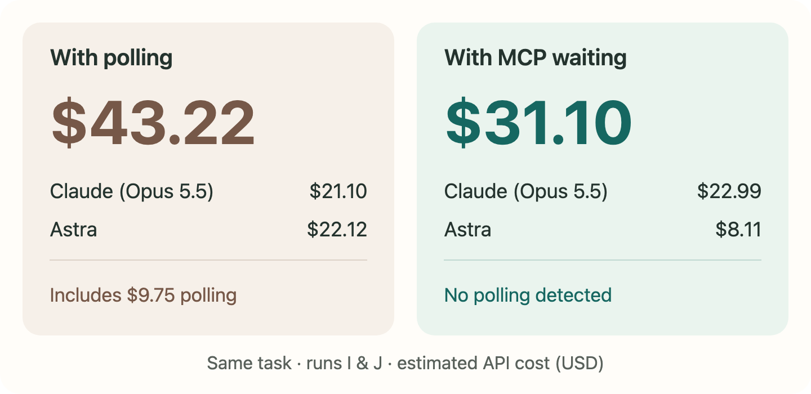

# Farcall MCP


Let Claude Code call Codex, or Codex call Claude Code, through one pending MCP call.

The worker builds or reviews. The parent waits for the result, then resumes the same session for corrections. No status polling needed.

## Install

**In Claude Code**, install the Codex worker.

```text
/plugin marketplace add regenrek/farcall-mcp
/plugin install codex-worker@farcall
```

Start the parent with automatic MCP backgrounding disabled.

```sh
CLAUDE_CODE_MCP_AUTO_BACKGROUND_MS=0 MCP_TOOL_TIMEOUT=7200000 claude
```

**In Codex**, install the Claude worker.

```sh
codex plugin marketplace add regenrek/farcall-mcp
codex plugin add claude-worker@farcall
```

Start a new session after installation. In Codex, keep the worker tool outside Code Mode. Follow the [host setup guide](docs/installation.md) for persistent settings, manual installation & a check that your host waits without polling.

## Use it

Ask Claude Code to use `/codex-worker:codex-worker`, or Codex to use `$claude-worker`, with your task. For example,

```text
Use Claude worker with this task: "Add CSV export to the reports page and run the tests."
Give me the changes and test results back.
```

The `run` tool accepts the task directly.

```json
{
  "cwd": "/absolute/path/project",
  "delegation_id": "review-001",
  "prompt": "Review the current changes. Do not edit files. Return concrete findings.",
  "model": "claude-opus-5-5",
  "effort": "high"
}
```

Change `model` to an identifier supported by the worker CLI. [Models, permissions & session resume](docs/usage.md).

Full logs are opt-in with `trace: true`. Normal runs keep only the state needed for retries & resume, plus the full answer if the returned preview is shortened. [Local state & tracing](docs/usage.md#optional-traces).

## Polling vs. MCP waiting



Two runs of the same task, with estimated API costs rather than subscription spend. Implementation & review also differed, so polling does not explain the whole difference. Run J used an earlier version of the MCP worker.

[See the full experiment, results & cost breakdown](https://kevinkern.dev/benchmarks/marlies-workflows/).

## Development

Run `pnpm install --frozen-lockfile` & `pnpm check`. Build generated bundles from `src/` with `pnpm build`.

[Architecture](docs/architecture.md) · [Verification](docs/verification.md) · [Release steps](docs/releasing.md)
