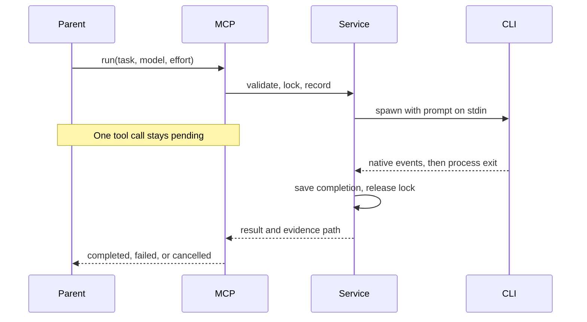

# Ownership

The prototype mixed provider arguments, artifact policy & process lifetime in one worker module. This project separates them so a transport fix does not become a second implementation of delegation rules.

| Question                        | Owner                                                                                                                                                                       |
| ------------------------------- | --------------------------------------------------------------------------------------------------------------------------------------------------------------------------- |
| Runtime owner                   | `platform/process.mjs` owns the child process & its awaited completion. `transport/server.mjs` owns the pending MCP request.                                                |
| First fix owner                 | Polling introduced by a parent belongs to its invocation/configuration. Cancellation bugs belong to `platform/process.mjs`.                                                 |
| Canonical long-term owner       | `application/delegate.mjs` owns delegation identity, checkout exclusivity, exact-session resume & result persistence.                                                       |
| Competing owners that are wrong | Skills must not implement process loops. Provider adapters must not invent separate locks or retry policy. The MCP transport must not decide model pricing or task quality. |
| Cleanup direction               | Keep `src/` canonical. Generate distributable bundles. Retire the earlier worker only after host acceptance, then remove its duplicate configuration.                       |

`core/contracts.mjs` validates public inputs. `adapters/claude.mjs` & `adapters/codex.mjs` own CLI arguments & native event interpretation. `platform/artifacts.mjs` owns filesystem operations, while `platform/checkout.mjs` finds the Git root used for locking. `transport/server.mjs` translates MCP cancellation & results without reimplementing the workflow.

There is no background task API. The only timers are a task deadline, bounded termination escalation & a one-second output drain after process exit. Provider errors remain errors even when a CLI exits with code zero. Raw events are retained only with `trace: true`.

Trace policy belongs to `application/delegate.mjs`; `platform/process.mjs` implements optional capture without changing event parsing or process cleanup. Required identity/completion state is separate from optional diagnostics. Inline prompts are hashed for request identity and copied only when tracing is enabled. Result previews are bounded independently of logging; a longer answer is kept in `result.txt`. Neither provider adapters nor skills maintain a second persistence policy.

The runtime supports macOS & Linux process groups. Windows is rejected until process-tree cleanup has its own implementation & tests. Provider CLIs keep their own configuration, authentication, hooks & project instructions. This package does not make those trustworthy or equivalent across hosts.
